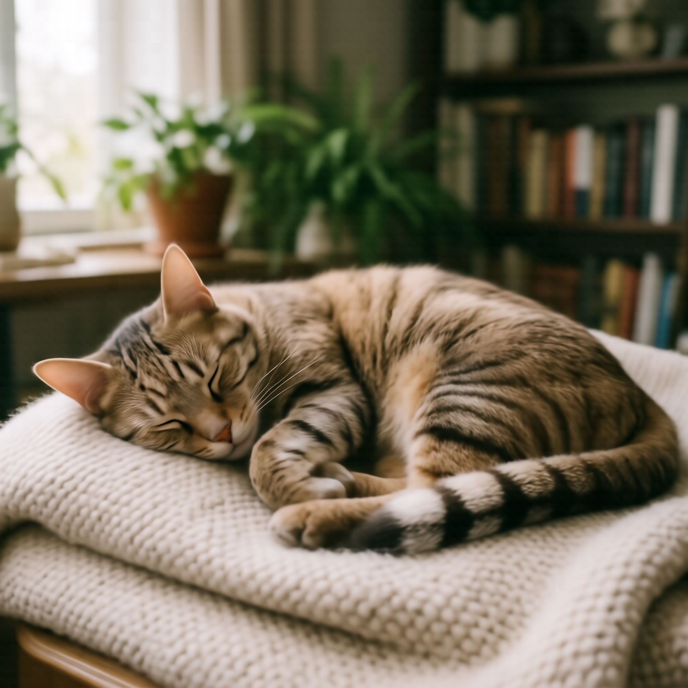
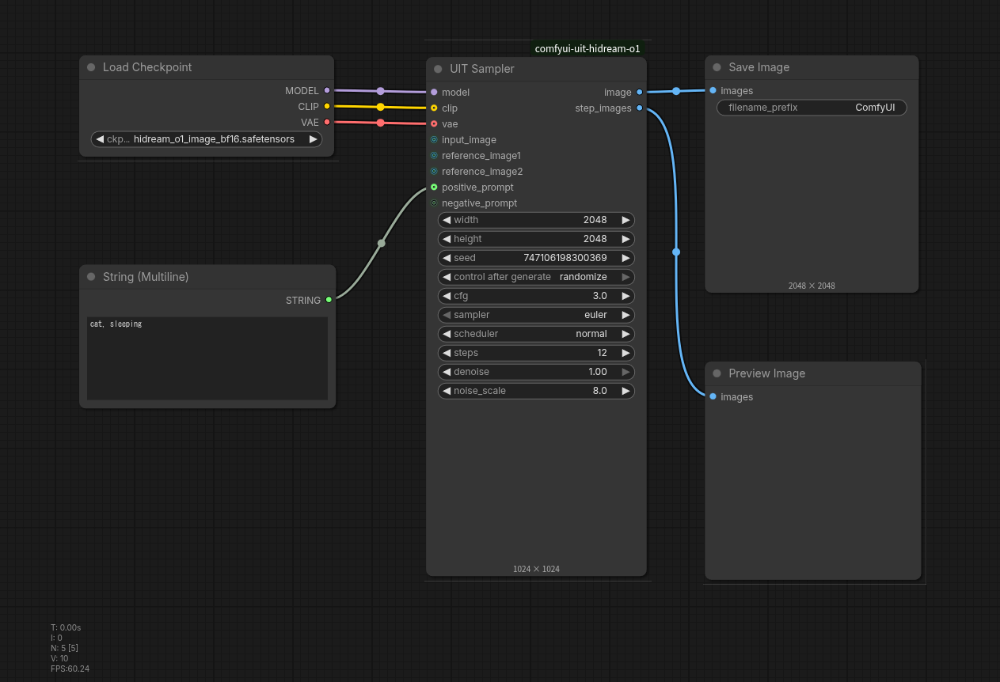
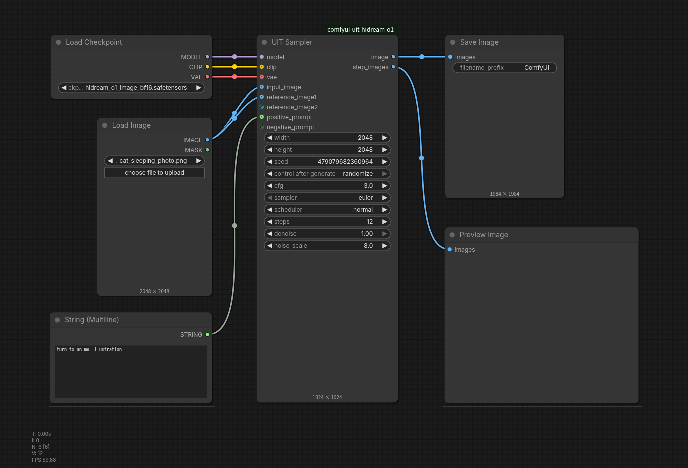
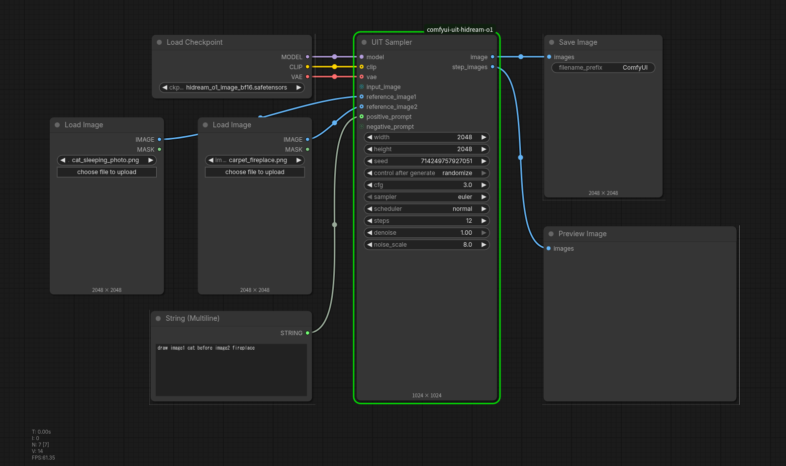
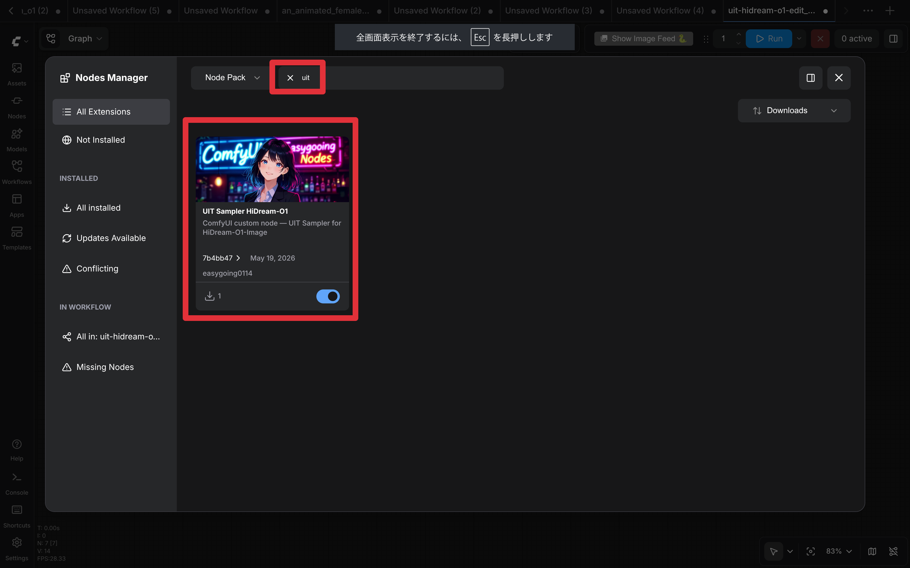

# ComfyUI-uit-hidream-o1

An all-in-one sampling node (**UIT Sampler**) for [HiDream-O1-Image](https://github.com/HiDream-ai/HiDream-O1-Image) .

## ✨ Features

### 🎛️ UIT Sampler

- Single node covering the full generation pipeline for UiT model.
- img2img support — input images are automatically rescaled to 4 MP via Lanczos
- Up to 2 reference images attachable to conditioning
- `step_images` output — all intermediate denoising steps in one batch tensor

## 👈 Models

- [Comfy-Org (Recommended)](https://huggingface.co/Comfy-Org/HiDream-O1-Image/tree/main/checkpoints)
- [HiDream-O1-Image (Official)](https://huggingface.co/HiDream-ai/HiDream-O1-Image)
- [HiDream-O1-Image-Dev (Official)](https://huggingface.co/HiDream-ai/HiDream-O1-Image-Dev)
- [HiDream-O1-Image-Dev-2604 (Official)](https://huggingface.co/HiDream-ai/HiDream-O1-Image-Dev-2604)

## 🔍 Workflows

These images contain ComfyUI workflow.

### Text to Image





### Image to Image




### Image Edit




### UIT Sampler

**Category:** `sampling/uit`

### Inputs

| Name | Type | Required | Description |
|---|---|---|---|
| `model` | MODEL | ✅ | HiDream-O1 model loaded via Load Checkpoint |
| `clip` | CLIP | ✅ | CLIP / text encoder (dummy connection) |
| `vae` | VAE | ✅ | VAE (dummy connection) |
| `input_image` | IMAGE | optional | Source image for img2img; auto-rescaled to 4 MP |
| `reference_image1` | IMAGE | optional | Reference image 1 |
| `reference_image2` | IMAGE | optional | Reference image 2 |
| `positive_prompt` | STRING | optional | Positive text prompt |
| `negative_prompt` | STRING | optional | Negative text prompt |

**HiDream-O1 does not use an external VAE or CLIP**, but due to the specifications of ComfyUI, a dummy connection is required.

### Settings

| Name | Type | Description |
|---|---|---|
| `width` | INT | Output width in pixels (ignored when `input_image` is connected) |
| `height` | INT | Output height in pixels (ignored when `input_image` is connected) |
| `seed` | INT | Random seed |
| `cfg` | FLOAT | Classifier-free guidance scale |
| `sampler` | ENUM | Sampler name (e.g. `euler`) |
| `scheduler` | ENUM | Scheduler name (e.g. `normal`) |
| `steps` | INT | Number of sampling steps |
| `denoise` | FLOAT | Denoising strength (1.0 = full generation) |
| `noise_scale` | FLOAT | Noise scale — base: `8.0`, dev: `7.5` |

**Default resolution** is 2048×2048 (4 MP), matching the HiDream-O1 training resolution. When `input_image` is connected, the resolution is derived from the rescaled image.

### Outputs

| Name | Type | Description |
|---|---|---|
| `image` | IMAGE | Final generated image |
| `step_images` | IMAGE | All intermediate step images stacked into one batch |

---

## 🔥 Installation

### Install via Nodes Manager



### Manual Install

1. Clone this repository into your ComfyUI `custom_nodes` folder:

```bash
cd ComfyUI/custom_nodes
git clone https://github.com/easygoing0114/ComfyUI-uit-hidream-o1.git
```

2. Restart ComfyUI. The **UIT Sampler** node should now appear in the node search under `sampling/uit`.

---

## ⚖️ License

This project is licensed under the [MIT License](LICENSE).

---

## Update History

## 2025.5.20 (v0.1.1)

- Fixed an issue where `reference_image` was also applied to `negative_cond`.

### 2025.5.19 (v0.0.3)

- Initial release: UIT Sampler for HiDream-O1-Image
